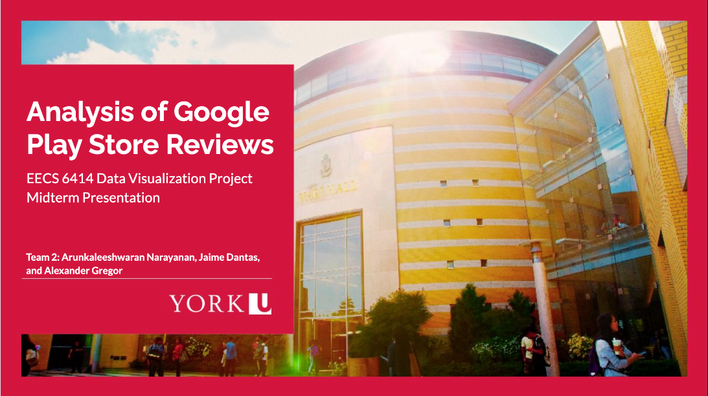

# Documentation
* The project instructions can be found [here](https://www.eecs.yorku.ca/~papaggel/courses/eecs6414/docs/project/project-all-in-one.pdf). You can also see mid-term presentation [here](https://github.com/EECS-6414/documentation/blob/main/EECS_6414_Data_Visualization_Project-Midterm_Presentation_v2.pdf).

 

## Project examples
These are two past projects:
* Anomaly Detection and Attack Identification in Network Traffic Based on Graph: [git](https://github.com/hyggs/Anomaly-Detection-and-Attack-Identification-in-Network-Traffic-Based-on-Graph).

* York Community: Demographics, Analysis and Housing Location Recommendation for New Students: [website](https://xuyanghan.github.io/eecs6414-team9/#null) and [git](https://github.com/xuyangHan/eecs6414-team9).

## Team members (team #2)
1. Arunkaleeshwaran Narayanan
2. Alexander Gregor
3. Jaime Dantas

## Dataset Amazon
[Amazon review data](https://nijianmo.github.io/amazon/index.html)

## Tool for Sentiment Analysis
[VADER](https://github.com/cjhutto/vaderSentiment)
- [Example](https://www.kaggle.com/speckledpingu/sentiment-analysis-with-vader) of sentiment analysis on a fairly large csv data set
- [Example](https://www.kaggle.com/wjia26/twittersentimentbycountry) of word cloud creation
